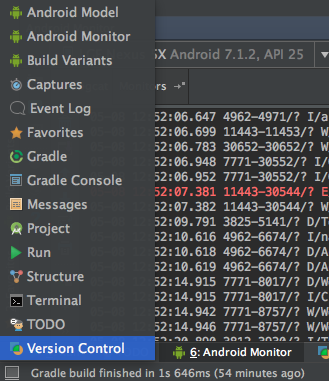
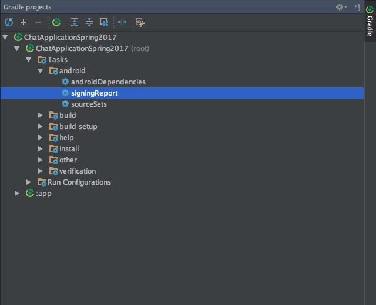

# Setting up the project

1. Clone/download project
2. Create new project on Firebase console
4. Click on Add Firebase to your Android app
    - Write eu.execom.chatapplicationspring2017 for Android package name
    - Click Register App
    - Click on Download google-services.json
    - Click Continue
    - Click Finish
5. Add downloaded google-services.json to ChatApp/app
6. Open Gradle projects (bottom left corner in Android Studio, click on Gradle) 
 
7. Double click on ChatApllicationSpring2017 (root) -> Tasks -> android -> signingReport 
 
8. Copy SHA1 from Android Studio terminal
9. Go to project settings in Firebase Console and scroll to end, click on ADD FINGERPRINT and paste SHA1
10. Go to Authentication on Firebase Console and enable Google Authentication